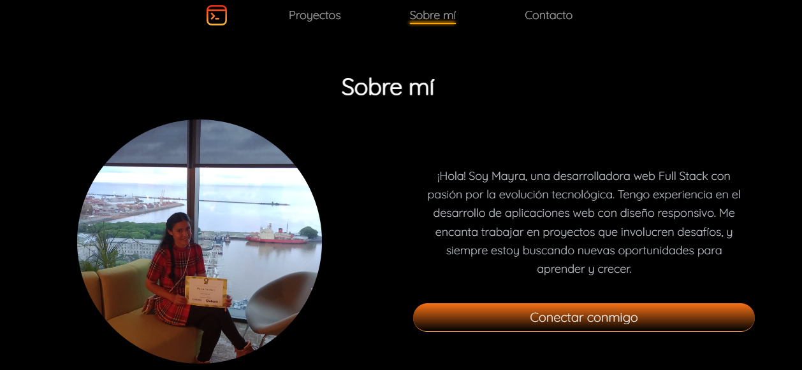

# Welcome to my portfolio!

This project has been created to showcase my skills and projects in web development, utilizing modern technologies such as Astro, Tailwind CSS, and Swiper.js.



## Description

This portfolio has been developed with Astro, a static site generator that enables the creation of fast and modern websites. The site's structure is responsive, ensuring it looks good on both mobile and desktop devices. Additionally, I have integrated Swiper.js to display my projects in an interactive and attractive manner.

## Features

- **Responsive Design**: Optimized for mobile and desktop devices using Tailwind CSS.
- **Smooth Animations**: Implemented with Swiper.js for fluid navigation between projects.
- **Dynamic Routes**: Implemented with Astro's `getStaticPaths` to generate static pages dynamically.
- **Props Usage**: Handling of properties within Astro components for modularity and code reuse.
- **Optimization**: Achieved 99% in performance and 94% in structure on GTmetrix.

## Technologies Used

- **Astro**: The main framework for building the site.
- **Tailwind CSS**: Used for responsive design and styling.
- **Swiper.js**: For animations and project presentations.
- **JavaScript**: For logic and dynamic interactions.

## 🚀 Project Structure

Inside of your Astro project, you'll see the following folders and files:

```text
/
├── public/
├── src/
│   └── components/
│       └── Header.astro
│   └── content/
│       └── diplomas/
│            └── diploma-01.md
|            └── ...
|       └── projects/
|       └── softSkills/
|       └── config.ts
│   └── layouts/
│       └── BaseLayout.astro
|       └── MarkdownProjectLayout.astro
│   └── pages/
│       └── projects/
│           └── [slug].astro
│           └── index.astro
│       └── tags/
│           └── [slug].astro
│           └── index.astro
│       └── index.astro
├── utils/
│   └── getUniqueTags.js
├── styles/
│   └── global.css
└── package.json

```
## 🧞 Commands

All commands are run from the root of the project, from a terminal:

| Command                   | Action                                           |
| :------------------------ | :----------------------------------------------- |
| `npm install`             | Installs dependencies                            |
| `npm run dev`             | Starts local dev server at `localhost:4321`      |
| `npm run build`           | Build your production site to `./dist/`          |
| `npm run preview`         | Preview your build locally, before deploying     |
| `npm run astro ...`       | Run CLI commands like `astro add`, `astro check` |
| `npm run astro -- --help` | Get help using the Astro CLI                     |

## 👀 Want to know more?


## Contact me on [LinkedIn](https://www.linkedin.com/in/mayra-cortinez-/)

